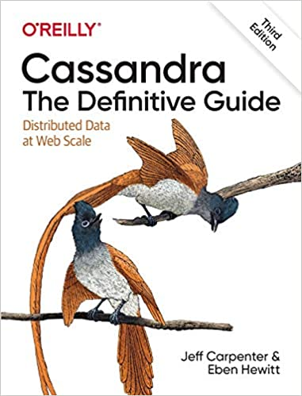

# reservation-service
This repository provides a sample microservice implementation based on the
reservation data model from the O'Reilly book [Cassandra: The Definitive Guide, 2nd Edition](http://shop.oreilly.com/product/0636920043041.do).

## Overview
The goal of this project is to provide a minimally functional implementation of a microservice that uses 
Apache Cassandra for its data storage via the DataStax Java Driver. The Reservation Service is implemented as a RESTful service using Spring Boot and exposes it's API via Swagger.

This service leverages the [reservation schema][schema] developed in the book, based on the data model shown here:

If you'd like to understand more about the motivation behind this design, you can access the data modeling chapter 
from the book for free at the [O'Reilly website][chapter].

## Requirements

This service runs on Java 11 or [12](https://jdk.java.net/12/) and uses the [DataStax Java Driver][driver].

## Quick Start
You'll need a Cassandra cluster consisting of least one node. Here are two quick ways to get a single Cassandra node running on your computer: 

- Option 1: Local instance
    - Download binaries for your platform from http://cassandra.apache.org/download/
    - Unzip the archive, for example `tar xvf apache-cassandra-3.11.6-bin.tar.gz some-directory`
    - Start Cassandra by running `bin/cassandra`
    - Start spring-boot app by running `./mvnw spring-boot:run` 
      
- Option 2: Run Cassandra and spring-boot app in Docker with `docker-compose` command.
    - `docker-compose up` if you want to follow the logs **OR**
    - `docker-compose up -d` to start all containers in detached mode.
    
- Running in IntelliJ IDEA
    - Confirm the default JDK is version 11 or later
    - Select the menu option “File -> New -> Project from Existing Sources” 
    - Select to import as a Maven project
    - Run the application
        - IntelliJ Ultimate: "Run -> Run 'ReservationServiceApp'"
        
Once the application is running, you can access the Swagger API at `localhost:8080`.

## Exercises
This repository is configured with branches that represent the start point and solution for various exercises 
used in an online course taught periodically with [O'Reilly Live Training][live-training]. These exercises 
remove some of the application code and require you to add it back in to get the service back to a functional 
state. There are exercises to help you learn the various ways of executing statements, such as `SimpleStatement`, 
`PreparedStatement`, `QueryBuilder` and the Object Mapper. Other exercises teach you how to use batches, 
lightweight transactions and materialized views.

To work on an exercise, select the branch that represents the start point of the exercise, for example: 
`git checkout simple-statement`. Then search through the code and complete the `TODO` items and run the 
service again until the service is working. You can view the solution code for a given exercise in the `_solution` branch, for example `git checkout simple-statement-solution`.

This repository has been updated in July 2019 to use the DataStax Java Driver Version 4.1. 
Branches beginning with `old_` represent exercises from a prior version of the course and use the 2.x Driver.

## Disclaimers
This service has a couple of shortcomings that would be inappropriate for a production-ready service
implementation:

- There is minimal data validation
- There is minimal handling of fault cases
- The schema makes use of Strings as identifiers instead of UUIDs

With respect to that last point about UUIDs: for this service I take the same approach that I did for the book.
When working with small scale examples, it is simpler to deal with IDs that are human readable strings. 
If I were intending to build a real system out of this or even implement more of the "ecosystem" of services
implied by the book's data model, I would move toward using UUIDs for identifiers. For more of my thinking on this 
topic, please read the [Identity blog post][identity] from my [Data Model Meets World][dmmw] series. 

## Credits
I found [this tutorial][tutorial] helpful in getting this implementation up and running quickly. 

Special thanks to [Cedrick Lunven][clun] for his help in modernizing this app.

Comments, improvements and feedback are welcome.

Copyright 2017-2019 Jeff Carpenter

Licensed under the Apache License, Version 2.0 (the "License");
you may not use this file except in compliance with the License.
You may obtain a copy of the License at

http://www.apache.org/licenses/LICENSE-2.0

Unless required by applicable law or agreed to in writing, software
distributed under the License is distributed on an "AS IS" BASIS,
WITHOUT WARRANTIES OR CONDITIONS OF ANY KIND, either express or implied.
See the License for the specific language governing permissions and
limitations under the License.

[tutorial]: http://www.springboottutorial.com/creating-rest-service-with-spring-boot
[schema]: /resources/reservation.cql
[dmmw]: https://medium.com/@jscarp/data-model-meets-world-c67a46681b39
[identity]: https://medium.com/@jscarp/data-model-meets-world-part-ii-identity-crisis-d517d3d4c39a
[chapter]: https://www.oreilly.com/ideas/cassandra-data-modeling
[driver]: https://docs.datastax.com/en/developer/java-driver/4.1/
[docker-hub]: https://hub.docker.com/_/cassandra
[live-training]: https://www.oreilly.com/live-training/
[clun]: https://github.com/clun